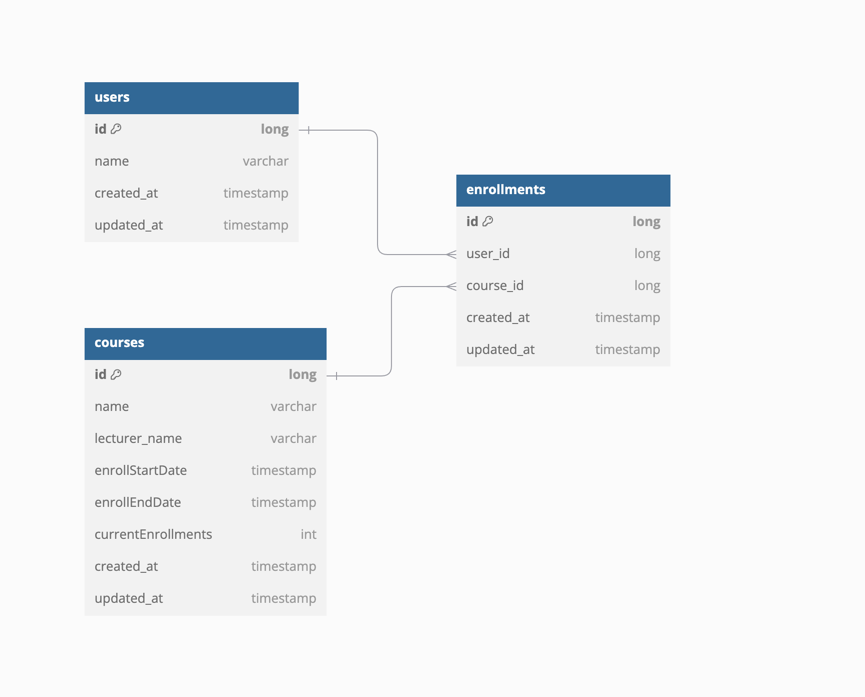

# 아키텍쳐 설계도


  
- 프로젝트 폴더구조를 tree 로 나타나면 다음과 같습니다.
```bash
  /src
  /users(회원)
  |	/presentation
  |	|    ㄴUserController.java
  |     |    ㄴ/dtos
  |     |    |     ㄴ요청/응답 dto들
  |     |     ㄴ/exceptionHandlers
  |     |          ㄴ  커스텀예외 핸들러들
  |	|	
  |	/domain
  |     |   ㄴ/exceptions
  |     |   |   ㄴ커스텀예외들
  |     |   ㄴ/services  
  |     |   |   ㄴ<I>UserService.java
  |     |   |   ㄴUserServiceImpl.java
  |     |   ㄴ<I>UserRepository.java
  |     |   ㄴUser.java
  |     |
  |	|	
  |	|  
  |	/infraStructure
  |		/applications
  |		|	ㄴUserMapper.java
  |		/dataSources
  |	  	    ㄴRepositoryImpl.java
  |	            ㄴ<I>ORMRepository.java
  |		
  |			
  /courses(강좌)
      이하 동일...
  /enrollments(강좌신청)
```
- 왜 3개의 계층으로 나눴나요?
  - presentation (컨트롤러) / domain(비즈니스 규칙 & 로직) / infra-structure(세부구현/ 외부 / 데이터접근 ) 으로 크게 3개의 계층으로 나눴습니다.
    - `Presentation` / `Domain` / `InfraStructure` 3계층으로 하였습니다.
      - **Presentation 계층** : 데이터를 전달하거나, 에러핸들링, API 호출시 라우팅 역할을 합니다.
      - **Domain 계층** : 비즈니스 규칙을 담당하는 계층입니다. 
        - 주로 엔티티 클래스, 서비스 로직, 서비스와 래포지토리 인터페이스를 갖고있습니다.
      - **InfraStructure 계층** : 데이터접근, 데이터 변환 등 가장 바깥층이며 비즈니스로직에 의거하여 실질적인 세부구현을 담당합니다.

  - 레이어 아키텍쳐는 Controller/Service/Repository 를 범용적으로 사용하고 있고 실무에서도 많이 사용하고 있는 아키텍쳐입니다.
- 이름을 Presentation / Domain / InfraStructure 로 했나요?
  - 아래 사진을 참고했습니다.
    

- 왜 application 계층과 dataSource 계층을 infraStructure안에 뒀나요? 
  - 여러개의 계층으로 나눠지게되면 계층이 복잡해지고 관리가 어려울거같습니다. 그래서 세밀한 분리를 하지않은 방향으로 했습니다. 
  - 데이터 매퍼의 경우에는 엔티티/도메인 으로 데이터를 변환하는 역할을 하기때문에 비즈니스 규칙보다는 규칙을 토대로 구현하는 계층에 가까웠습니다. 그래서 infra-structure 에 배치했습니다.
    - **데이터베이스에서 가져온 데이터를 도메인 모델로 변환하거나, 도메인 모델을 데이터베이스 엔티티로 변환하는 역할을 하므로, 인프라계층 또는 응용 계층에 배치**하는 것이 적절합니다. 
    - 데이터 매퍼는 도메인 모델과 데이터베이스 엔티티 간의 변환을 담당합니다.

---

# [ERD Diagram](https://dbdiagram.io/d/hh-school-6768039bfc29fb2b3b163a1c)



- 엔티티 구성
    - user (회원)
    - course (강좌)
    - enrollment(수강신청)

- 엔티티 관계 
  - 회원 : 수강신청 = 1 : N 
  - 강의 : 수강신청 = 1 : N

- 강의에 수강신청인원수를 넣었습니다. 강의가 신청되면 인원수를 +1씩 카운트하는 방식입니다.
  - 인원 30명 정원을 체크하기 위함입니다.
- 이전 erd인 days, enableEnroll 필드는 삭제했습니다.
- 동일 유저가 동일 강의를 중복 신청을 막기위해서, 한명의 유저는 강의를 딱 한번만 신청하기 위해서
  - enrollment 테이블에 2개의 외래키 userId, courseId를 복합키로 했습니다.
  - 즉 (userId, courseId) = (1,1), (1,1) 으로 중복된 데이터로하여 enrollment에 추가하지 못하도록 했습니다.

    
- 모든 엔티티에는 공통적으로 createdAt, updatedAt 필드를 갖기 때문에 모든 엔티티클래스는 BaseEntity 를 상속 합니다.

```java
@MappedSuperclass
public abstract class BaseEntity {
    @Column(name = "created_at", nullable = false, updatable = false)
    private LocalDateTime createdAt;

    @Column(name = "updated_at", nullable = false)
    private LocalDateTime updatedAt;

    @PrePersist
    protected  void onCreate() {
        this.createdAt = LocalDateTime.now();
        this.updatedAt = LocalDateTime.now();
    }

    @PreUpdate
    protected void onUpdate() {
        this.updatedAt = LocalDateTime.now();
    }

    // Getters
    public LocalDateTime getCreatedAt() {
        return createdAt;
    }

    public LocalDateTime getUpdatedAt() {
        return updatedAt;
    }
}

```

---

# 필수 기능 구현 커밋

- (기능1) 수강신청
  - `[POST] /courses/apply`
  - 서비스코드: https://github.com/loveAlakazam/hh-school/pull/2/files#diff-ab69955052ae9bddd5e447f9362cb6b787f1dd02075a50d6334cf3c66d24a8c2R52-R81
  - 테스트코드: https://github.com/loveAlakazam/hh-school/pull/2/files#diff-bde604e8d29a305be7da285b45cbed77fa8d1a3aa8f206d5e7997b0bc4bb2883R498-R550 
  
<br>
  
- (기능2) 수강신청 가능한 강좌목록 조회(+ offset기반 페이지네이션)
  - `[GET] /courses`
  - 서비스코드: https://github.com/loveAlakazam/hh-school/pull/2/files#diff-ab69955052ae9bddd5e447f9362cb6b787f1dd02075a50d6334cf3c66d24a8c2R83-R92
  - 테스트코드: https://github.com/loveAlakazam/hh-school/pull/2/files#diff-bde604e8d29a305be7da285b45cbed77fa8d1a3aa8f206d5e7997b0bc4bb2883R368-R497
  - 신청시작날짜(enrollStartDate) <= 현재날짜 <= 신청종료날짜(enrollEndDate) 인 현재를 기준으로 신청가능한 강의목록조회로 나타냈습니다.
  
<br>

- (기능3) 특정 userId로 수강신청 완료 강좌목록조회
  - `[GET] /courses/my?userId={userId}`
  - 서비스코드: https://github.com/loveAlakazam/hh-school/pull/2/files#diff-ab69955052ae9bddd5e447f9362cb6b787f1dd02075a50d6334cf3c66d24a8c2R126-R134 
  - 테스트코드: https://github.com/loveAlakazam/hh-school/pull/2/files#diff-bde604e8d29a305be7da285b45cbed77fa8d1a3aa8f206d5e7997b0bc4bb2883R604-R635 


# 심화 기능 구현 커밋로그
- 동일한 유저가 동시에 5번 신청했을 때 1번만 신청할 수 있도록한다.
  - enrollment는 (userId, courseId) 복합키를 가지므로 동일한 유저가 동일한 강의를 중복으로 수강신청하지 못하도록 하기 위함입니다.
  
- 여러명의 유저가 동시에 신청했을 때 30명만 신청이 가능하다.
  - 수강신청할때마다 currentEnrollments(현재수강신청인원수)가 +1 씩 늘어납니다.
  - 수강신청이전에 체크하는 함수로 30명일때만 신청가능하도록하였습니다.
    - (1) 이미 사용자가 신청한 강의인지 체크 (isAlreadyEnrolledCourse)
    - (2) 현재 신청가능한 강의인지 체크(isAvailableEnrollCourseNow)
      - 수강신청시작날짜 <= 현재날짜 <= 수강신청종료날짜 인가?
      - 수강신청인원수 < 30 을 만족하는가?


---

### 코드리뷰 사항
- 테스트코드가 정말 깁니다. 다들 단기간에 하신게 정말 대단합니다...ㄷㄷ 적절한건지 복잡하지 않은지 가독성에 날카로운 지적 해주시면 감사하겠습니다.
- 저의경우에는 전체수정이 아닌 부분수정을 했는데요. 부분수정이란 엔티티의 일부필드를 수정할 수 있음을 의미합니다. 혹시 부분수정을 쉽게 구현하는 방법을 아실까요? 저의 경우에는 if문으로 남발하여 조금 코드가 지져분해보여요ㅠㅠ
  - RequestDto
    ```java
    @Builder
    public record UpdateCourseRequestDto (Long id, String name, String lecturerName,
  
      @JsonFormat(pattern= "yyyy-MM-dd")
      LocalDate enrollStartDate,
  
      @JsonFormat(pattern= "yyyy-MM-dd")
      LocalDate enrollEndDate,
      Integer currentEnrollments
    ) {
        public UpdateCourseRequestDto {
            if(id != null) checkCourseId(id);
            if(name != null) checkCourseName(name);
            if(lecturerName != null) checkLecturerName(lecturerName);
            if(enrollStartDate != null) checkEnrollStartDate(enrollStartDate);
            if(enrollStartDate != null && enrollEndDate != null) checkEnrollEndDate(enrollStartDate, enrollEndDate);
            if(currentEnrollments != null) checkCurrentEnrollments(currentEnrollments);
        }
    }
    ```
  - (도메인 -> 응답dto) 전환, 혹은 (응답dto -> 도메인) 전환이 어려웠는데 조금 쉽게 하는 방법을 알고싶습니다.   
    - 아래코드는 요청dto인데요. toEntity() 를 사용하는 경우에는 dto에서 엔티티로 전환할때가 필요해서 넣어놨습니다. read-only이고 수정을 막아준다고해서 DTO를 record로 쓰려고했지만 dto안에 생성자를 호출하는로직이 있는데요. 저도 이부분이 조금 아쉽습니다.. 조금 더 좋은 방법을 알려주시면 감사하겠습니다.
    - dto가 너무 지져분하네요 ㅠ_ㅠ
    ```java
    public record CreateCourseRequestDto (
        String name,
        String lecturerName,
        LocalDate enrollStartDate,
        LocalDate enrollEndDate) {
      
    @Builder
    public CreateCourseRequestDto(String name, String lecturerName, LocalDate enrollStartDate, LocalDate enrollEndDate) {
     // 기본값 셋팅
    this.enrollStartDate = enrollStartDate == null ? LocalDate.now() : enrollStartDate;
    this.enrollEndDate = enrollEndDate == null ? this.enrollStartDate.plusDays(DEFAULT_DAYS) : enrollEndDate;
  
          // 호출전에 유효성검사
          CourseValidator.checkCourseName(name); // 강좌명
          CourseValidator.checkLecturerName(lecturerName); // 강연자명
          this.name = name;
          this.lecturerName = lecturerName;
    }
      
    // CreateCourseRequestDto -> Course 엔티티
    public Course toEntity() {
          Course course = Course.builder()
                  .name(name)
                  .lecturerName(lecturerName)
                  .enrollStartDate(enrollStartDate)
                  .enrollEndDate(enrollEndDate)
                  .build();
          return course;
      }
    }
    ```
    
- 빌더패턴을 올바르게 사용하고 싶은데, 규칙없이 두서없이 쓰는거 같습니다. record 에도 `@Builder`를 사용하는 편인가요? builder() 는 주로 언제쓰는편이세요?


---

# 궁금한 점


> 12/27(금) 에 답변받았습니다.

- 아래질문들은 과제 제출하면 답변을 드린다고 하셔서 리마인드차 넣었습니다.

- Q1) 서비스로직에서 다른 서비스 함수를 호출하는건 좋은 방법일까요?  아니면 그냥 래포지토리를 불러와서 사용하는게 좋을까요? 
  - 예 1) 강의 신청 서비스함수안에  유저서비스의 유저조회함수를 호출하는 경우
  - 예 2) 강의 신청 서비스함수에 유저가 유효한 유저인지를 조회하려면 유저데이터베이스 유저아이디로 유저데이터를 리턴받아서 유저가 유효한지 확인한다.

- Q2) POST, PATCH, PUT 메소드 API를 설계하고 코드로 나타낼 때 RequestDto를 계층을 거칠때마다 전달하는 것에 대하여

저는  ReuqestBody를  RequestDto로 감싸서 controller의 input인자로 나타냈습니다.
만일 controller의 input인자의 개수와 service메서드의 input인자 개수가 동일한 경우에는 
controller의 input인자인 RequestDto를 service메서드의 input인자로 그대로 전달하는 식으로했습니다.

```java
// 컨트롤러의 requestBody를 감싸주는 CreateCourseRequestDto 를 서비스까지 전파.
// controller 예
@PostMapping
@ResponseStatus(HttpStatus.CREATED)
public ResponseEntity<UserResponseDto> createCourse(@RequestBody CreateCourseRequestDto requestDto) {
	...
}

// service 예
@Override
public CourseResponseDto create(CreateCourseRequestDto requestDto) {

}     
```

그런데 RequestDto를 전계층의 input 인자로 전달하는게 좋지않은 방법이란걸 알고있습니다. 
- Q2-1) 멘토님은 어느레이어까지 요청dto를 전달하는 편인가요?

그리고 개발을 하다보면 컨트롤러의 input 인자와 서비스 input 인자의 개수가 다를 경우가 있습니다.

- Q2-2) 그럴때는 dto를 따로 만들어서 관리하는편인가요?
- Q2-3) input 인자 개수가 몇개일때 requestDto로 감싸는편인가요?

- Q3) 아키텍쳐구조와 erd 그림 이미지에 대한 피드백부탁드립니다. 
테이블조인을 하는 방법만 떠오릅니다..ㅎㅎ 여기서는 2개의 테이블을 조인하지만,, 
테이블조인이 성능에 안좋다고하는데 테이블 몇개정도까지해야 위험한걸까요? 

- Q4) 에러 핸들링에 대한 멘토님의 생각이 궁금합니다.
    - 에러처리할때 커스텀에러를 정의하나요?
    - 에러문구의 경우 상수로 관리하는편이 좋을까요?

---

# KPT 회고

- Keep
  - 새벽 5-6시 기상 하고, 주말에도 평일처럼 일어나서 작업을했습니다.
  - 최대한 클린아키텍쳐에 집중을 했습니다.
  - 적극적으로 질문을 했습니다.

- Problem
  - 클린아키텍쳐에 집중하느라 필수기능 구현이 늦었습니다 ㅠㅠ
  - 기간안에 업무를 처리를 위한 시간안배를 못했습니다.
    - 연휴있어도 이렇게 빡센데 연휴없는날에는 회사와 병행하기 쉽지않겠다는 생각이 들었습니다.
    - 정말 포기할까, 다음기수로 미룰까 생각을 정말 많이했습니다. 수업의 취지는 좋은데 회사도 점점 바빠지기 시작했거든요 ㅠ

- Try
  - 모닝루틴 계속 유지하기.
  - 목적을 분명화 시키기.
    - 내가 해야할 목적이 무엇인지 정확히 파악하기
  - 과제 제출했다고 끝나는게 아니라 계속 도전하기
  - 코드리팩터링 습관들이기


